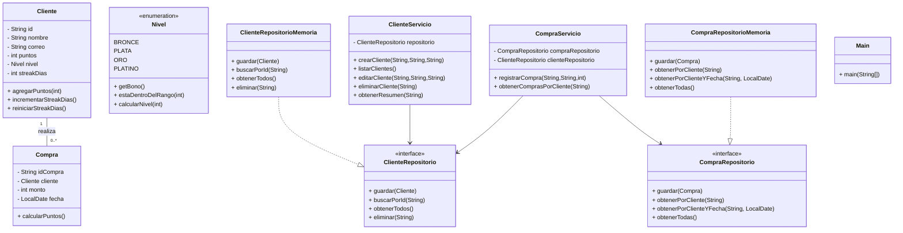
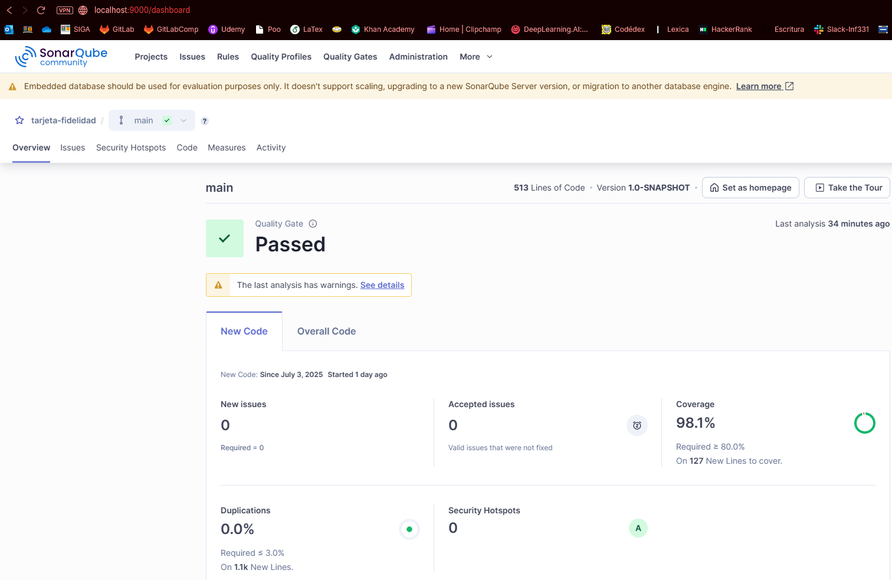
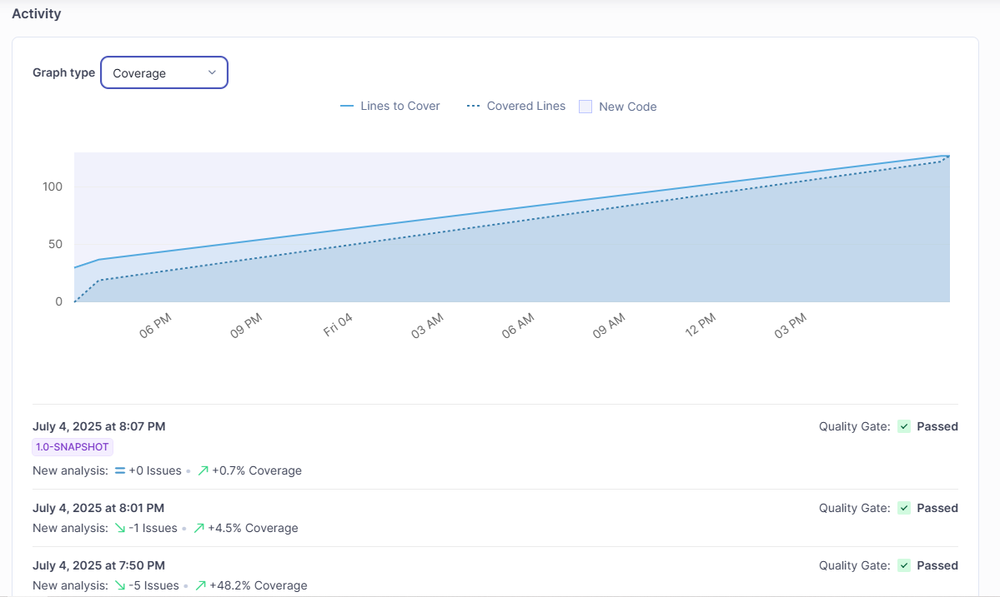
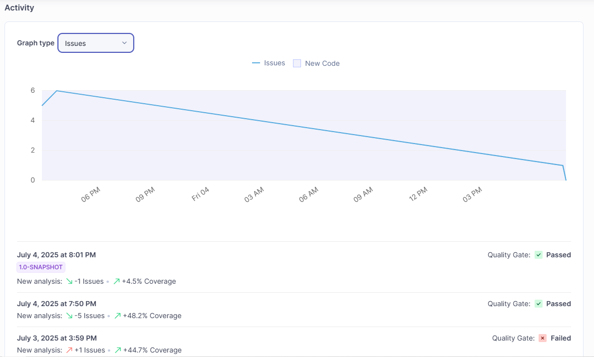

# Documentación del Proyecto de Fidelidad

## Índice

1. [Visión General](#visión-general)
2. [Tecnologias](#tecnologias)
3. [Instrucciones de Uso](#instrucciones-de-uso)
   - [Levante del proyecto](#levante-del-proyecto)  
   - [Compilar](#compilar)  
   - [Ejecutar](#ejecutar)
     - [Forma1 - probar SonarQube](#forma1)
     - [Forma2 - probar Jacoco](#forma2)
5. [Diagrama de Clases](#diagrama-de-clases)  
6. [Descripción de Archivos](#descripción-de-archivos)  
   - [Interfaces de Repositorio](#interfaces-de-repositorio)  
   - [Implementaciones de Repositorio](#implementaciones-de-repositorio)  
   - [Servicios de Negocio](#servicios-de-negocio)  
   - [Modelos (Entidades y Enum)](#modelos-entidades-y-enum)  
   - [Clase Principal](#clase-principal)  
   - [Pruebas Unitarias](#pruebas-unitarias)   
7. [Ejemplo de Salida de Tests (Jacoco)](#ejemplo-de-salida-de-tests-jacoco)
8. [Ejemplo de Salida de Tests (SonarQube)](#ejemplo-de-salida-de-tests-sonarqube)  
9. [Cobertura de Pruebas](#cobertura-de-pruebas)  
10. [Licencia](#licencia)  
11. [Otras Consideraciones](#otras-consideraciones)  

---

## Visión General

Este proyecto implementa un **sistema de fidelidad** donde:

- Se gestionan **clientes** con puntos y niveles (BRONCE, PLATA, ORO, PLATINO).  
- Se registran **compras**, calculando puntos según monto y nivel, con bonos por «streak» diario.  
- La persistencia se abstrae vía **interfaces** de repositorio e implementaciones en memoria.  
- Hay una **capa de servicio** para la lógica de negocio y una **CLI** básica (`Main`) para interactuar.

---

## Tecnologias
Se usaron las siguientes tecnologías:

### Idle
* IntelliJ Idea 2024.3.5
* SonarQube
* Docker Desktop v28.2.2 (Contenedor de SonarQube)

Dependencias (configuración pom.xml)
* Maven v4.0.0
* JUnit 5 v5.10.0
* SLF4J API v2.0.9
* Logback binding v1.5.13
* Jacoco v0.8.10

---
# Instrucciones de Uso
Para replicar el uso, tener en consideración que se usaron las tecnologias mencionadas.

### Levante del proyecto
Con el uso de docker desktop con el comando: 
```bash
docker run -d --name sonarqube -p 9000:9000 sonarqube:community
```
Con esto levantamos la imagen sonarqube en `localhost:9000`
Si todo salió bien, verás la pantalla de login de sonarqube
* Usuario: `admin`
* Contraseña: `admin`

Se te pedirá que cambiar la contraseña(anótala si la cambias).
Tendrás que crear un token de autenticación para hacer la conexión atravez del IDLE
1.  Arriba a la derecha, haz click en tu usuario `My account`
2.  ve a la pestaña `Security`
3.  En "Generate Tokens", escribe un nombre (ej. fidelidad-token) y haz click en generate
4.  copia el token generado y guárdalo (no se muestra otra vez)

Desde el menú principal, haz click en `Create Project`

1.  Project key: (ej: `tarjeta-fidelidad`)
2.  Display name: (ej: `Tarjeta Fidelidad`)
3.  haz click en `Set Up`
4.  Elige **Maven** como método de análisis

### Ejecutar
Existen 2 formas de ejecutar el proyecto, a través de Jacoco o SonarQube.

### Forma 1 - Probar SonarQube (por WEB)
```bash
mvn clean verify sonar:sonar -Dsonar.projectKey=tarjeta-fidelidad -Dsonar.host.url=http://localhost:9000 -Dsonar.token=EL_TOKEN_GENERADO
```
**Nota:** Intercambia "EL_TOKEN_GENERADO" por tu token generado en el paso anterior para asegurar una conexion segura.

**Nota1:** El terminal en donde va las lineas de comando es la que te proporciona el IDLE con Maven, ya que viene intregado con el IDLE, por lo que no es necesario una instalación de maven.

### Forma 2 - Probar Jacoco (por IDLE)
Está forma es más sencilla ya que el idle dispone de botones que automatizan su uso atraves de Maven, en la barra lateral derecha se encuentra Maven, haciendo click se abre el menú, dentro de la carpeta `lifecycle`
se encuentran los botones de `clean`,`validate`,`compile`,`test` los cuales ejecutan los siguiente comandos:
```bash
mvn clean compile
```

```bash
mvn test
```

_Generar reporte de cobertura_:
```bash
mvn jacoco:report
```

## Diagrama de Clases



---

## Descripción de Archivos

### Interfaces de Repositorio

| Archivo                                                            | Responsabilidad                                        |
| ------------------------------------------------------------------ | ------------------------------------------------------ |
| **ClienteRepositorio.java**<br/>`src/main/java/com/fidelidad/repositorio` | Define operaciones CRUD básicas para `Cliente`.        |
| **CompraRepositorio.java**<br/>`src/main/java/com/fidelidad/repositorio`  | Define operaciones de persistencia para `Compra`.      |

#### ClienteRepositorio.java

- **Métodos**:  
  - `void guardar(Cliente cliente)`  
  - `Cliente buscarPorId(String id)`  
  - `List<Cliente> obtenerTodos()`  
  - `void eliminar(String id)`  

#### CompraRepositorio.java

- **Métodos**:  
  - `void guardar(Compra compra)`  
  - `List<Compra> obtenerPorCliente(String idCliente)`  
  - `List<Compra> obtenerPorClienteYFecha(String idCliente, LocalDate fecha)`  
  - `List<Compra> obtenerTodas()`  

---

### Implementaciones de Repositorio

| Archivo                                                                     | Detalle                                                  |
| --------------------------------------------------------------------------- | -------------------------------------------------------- |
| **ClienteRepositorioMemoria.java**<br/>`src/main/java/com/fidelidad/repositorio` | Implementa `ClienteRepositorio` con un `HashMap`.        |
| **CompraRepositorioMemoria.java**<br/>`src/main/java/com/fidelidad/repositorio`  | Implementa `CompraRepositorio` con una `List<Compra>`.   |

#### ClienteRepositorioMemoria.java

- Usa `Map<String, Cliente> base`.
- Sobrescribe datos al volver a guardar mismo ID.
- Devuelve copias para evitar fuga de referencias.

#### CompraRepositorioMemoria.java

- Mantiene `List<Compra> compras`.
- Filtra con Streams por cliente y/o fecha.
- Retorna nueva lista en `obtenerTodas()`.

---

### Servicios de Negocio

| Archivo                                                        | Lógica principal                                                    |
| -------------------------------------------------------------- | -------------------------------------------------------------------- |
| **ClienteServicio.java**<br/>`src/main/java/com/fidelidad/servicio` | Reglas de validación y CRUD de clientes; resumen de puntos y nivel. |
| **CompraServicio.java**<br/>`src/main/java/com/fidelidad/servicio`  | Registro de compra, cálculo de puntos, gestión de streak diario.    |

#### ClienteServicio.java

- **Crear Cliente**: valida formato de correo antes de instanciar.  
- **Editar Cliente**: valida existencia y formato de correo.  
- **Obtener Resumen**: presenta nombre, nivel, puntos y streak de bonus.  

#### CompraServicio.java

- Valida existencia de `Cliente`.  
- Obtiene compras del día para calcular si aplica bono extra (+10 pts en la 3ª compra en adelante).  
- Calcula puntos base (`monto/100`), aplica **bono por nivel** y **bono de streak**.  
- Actualiza `streakDias` y puntos del `Cliente`, luego persiste la `Compra`.  
- Permite listar historial de compras por cliente.

---

### Modelos (Entidades y Enum)

| Archivo                     | Descripción                                         |
| --------------------------- | --------------------------------------------------- |
| **Cliente.java**            | Entidad con `id`, `nombre`, `correo`, `puntos`(0) , `nivel`(BRONCE) y `streakDias`(0). |
| **Compra.java**             | Entidad con `idCompra`, `monto`, `fecha` y método de cálculo de puntos. |
| **Nivel.java**              | Enum de niveles con rangos y porcentaje de bono.    |

#### Cliente.java

- **Atributos**:  
  - `String id, nombre, correo`  
  - `int puntos, streakDias`  
  - `Nivel nivel`  
- **Métodos**:  
  - `agregarPuntos(int)`: suma y actualiza nivel.  
  - `incrementarStreakDias()`, `reiniciarStreakDias()`.  

#### Compra.java

- **Atributos**:  
  - `String idCompra`  
  - `Cliente cliente`  
  - `int monto`  
  - `LocalDate fecha`  
- **Método clave**:  
  - `int calcularPuntos()`: redondea hacia abajo `monto/100*(1+bonoNivel)`.

#### Nivel.java

- **Constantes**: `BRONCE(0–499, 0%)`, `PLATA(500–1499, 20%)`, `ORO(1500–2999, 50%)`, `PLATINO(3000+, 100%)`.  
- **Métodos**:  
  - `getBono()`: retorna porcentaje de bono.  
  - `estaDentroDelRango(int)`.  
  - `static calcularNivel(int)`: determina nivel según puntos.

---

### Clase Principal

#### Main.java (`src/main/java/com/fidelidad/Main.java`)

- **CLI interactiva** con `Scanner` y menús SLF4J:  
  1. Gestión de Clientes  
  2. Gestión de Compras  
  3. Mostrar puntos y nivel de un cliente  
  4. Salir  
- **Submenús** para crear, listar, editar y eliminar clientes; registrar y listar compras.  
- Orquesta las dependencias:  
  - `ClienteRepositorioMemoria → ClienteServicio`  
  - `CompraRepositorioMemoria → CompraServicio`

---

### Pruebas Unitarias

| Test Suite                                        | Objetivo                                      |
| ------------------------------------------------- | --------------------------------------------- |
| **ClienteTest.java**         (`com.fidelidad.modelo`) | Validación de constructor, niveles y excepciones. |
| **CompraTest.java**          (`com.fidelidad.modelo`) | Cálculo de puntos y getters de `Compra`.       |
| **ClienteRepositorioTest.java**  (`com.fidelidad.repositorio`) | CRUD y comportamiento de `ClienteRepositorioMemoria`. |
| **CompraRepositorioTest.java**   (`com.fidelidad.repositorio`) | Filtrado y obtención de compras en memoria.    |
| **ClienteServicioTest.java**   (`com.fidelidad.servicio`)    | Validaciones, flujos de creación/edición/eliminación de clientes. |
| **CompraServicioTest.java**    (`com.fidelidad.servicio`)    | Lógica de puntos y bono de streak en compras.  |

---

## Ejemplo de Salida de Tests (Jacoco)

```
-------------------------------------------------------
 T E S T S
-------------------------------------------------------
Running com.fidelidad.modelo.ClienteTest
[INFO] Tests run: 5, Failures: 0, Errors: 0, Skipped: 0, Time elapsed: 0.154 s - in com.fidelidad.modelo.ClienteTest
[INFO] Running com.fidelidad.modelo.CompraTest
[INFO] Tests run: 3, Failures: 0, Errors: 0, Skipped: 0, Time elapsed: 0.032 s - in com.fidelidad.modelo.CompraTest
[INFO] Running com.fidelidad.repositorio.ClienteRepositorioTest
[INFO] Tests run: 4, Failures: 0, Errors: 0, Skipped: 0, Time elapsed: 0.026 s - in com.fidelidad.repositorio.ClienteRepositorioTest
[INFO] Running com.fidelidad.repositorio.CompraRepositorioTest
[INFO] Tests run: 3, Failures: 0, Errors: 0, Skipped: 0, Time elapsed: 0.03 s - in com.fidelidad.repositorio.CompraRepositorioTest
[INFO] Running com.fidelidad.servicio.ClienteServicioTest
[INFO] Tests run: 8, Failures: 0, Errors: 0, Skipped: 0, Time elapsed: 0.022 s - in com.fidelidad.servicio.ClienteServicioTest
[INFO] Running com.fidelidad.servicio.CompraServicioTest
[INFO] Tests run: 6, Failures: 0, Errors: 0, Skipped: 0, Time elapsed: 0.024 s - in com.fidelidad.servicio.CompraServicioTest
[INFO] 
[INFO] Results:
[INFO] 
[INFO] Tests run: 29, Failures: 0, Errors: 0, Skipped: 0
[INFO] 
[INFO] 
[INFO] --- jacoco:0.8.10:report (report) @ tarjeta-fidelidad ---
[INFO] Loading execution data file C:\Projects\Java\T3_INF331\Tarjeta_fidelidad_gamificada\target\jacoco.exec
[INFO] Analyzed bundle 'tarjeta-fidelidad' with 7 classes
[INFO] ------------------------------------------------------------------------
[INFO] BUILD SUCCESS
[INFO] ------------------------------------------------------------------------
[INFO] Total time:  10.027 s
[INFO] Finished at: 2025-07-04T21:41:10-04:00
[INFO] ------------------------------------------------------------------------
```
---
## Ejemplo de Salida de Test (SonarQube)
Usa Jacoco para la evaluación de Test y luego muestra lo siguiente:

```
[INFO] ------------------< com.fidelidad:tarjeta-fidelidad >-------------------
[INFO] Building tarjeta-fidelidad 1.0-SNAPSHOT
[INFO]   from pom.xml
[INFO] --------------------------------[ jar ]---------------------------------
[INFO] 
[INFO] --- sonar:4.0.0.4121:sonar (default-cli) @ tarjeta-fidelidad ---
[INFO] 21:43:33.048 Java 21.0.7 Microsoft (64-bit)
[INFO] 21:43:33.049 Windows 10 10.0 (amd64)
[INFO] 21:43:33.397 User cache: C:\Users\David\.sonar\cache
[INFO] 21:43:33.658 Communicating with SonarQube Server 25.6.0.109173
[INFO] 21:43:33.674 Default locale: "es_CL", source code encoding: "UTF-8"
[INFO] 21:43:34.879 Load global settings
[INFO] 21:43:35.239 Load global settings (done) | time=362ms
[INFO] 21:43:35.265 Server id: 147B411E-AZfQnedkfxahHfUu-jmr
[INFO] 21:43:35.281 Loading required plugins
[INFO] 21:43:35.281 Load plugins index
[INFO] 21:43:35.464 Load plugins index (done) | time=183ms
[INFO] 21:43:35.464 Load/download plugins
[INFO] 21:43:35.491 Load/download plugins (done) | time=27ms
[INFO] 21:43:35.996 Process project properties
[INFO] 21:43:36.022 Process project properties (done) | time=26ms
[INFO] 21:43:36.041 Project key: tarjeta-fidelidad
[INFO] 21:43:36.042 Base dir: C:\Projects\Java\T3_INF331\Tarjeta_fidelidad_gamificada
[INFO] 21:43:36.042 Working dir: C:\Projects\Java\T3_INF331\Tarjeta_fidelidad_gamificada\target\sonar
[INFO] 21:43:36.051 Load project settings for component key: 'tarjeta-fidelidad'
[INFO] 21:43:36.212 Load project settings for component key: 'tarjeta-fidelidad' (done) | time=161ms
[INFO] 21:43:36.246 Load quality profiles
[INFO] 21:43:37.459 Load quality profiles (done) | time=1213ms
[INFO] 21:43:37.531 Load active rules
[INFO] 21:43:41.622 Load active rules (done) | time=4091ms
[INFO] 21:43:41.659 Load analysis cache
[INFO] 21:43:41.829 Load analysis cache (814 bytes) | time=170ms
[INFO] 21:43:42.023 Preprocessing files...
[INFO] 21:43:42.380 2 languages detected in 17 preprocessed files (done) | time=356ms
[INFO] 21:43:42.381 0 files ignored because of scm ignore settings
[INFO] 21:43:42.386 Loading plugins for detected languages
[INFO] 21:43:42.387 Load/download plugins
[INFO] 21:43:42.433 Load/download plugins (done) | time=46ms
[INFO] 21:43:42.693 Load project repositories
[INFO] 21:43:42.984 Load project repositories (done) | time=291ms
[INFO] 21:43:43.015 Indexing files...
[INFO] 21:43:43.015 Project configuration:
[INFO] 21:43:43.016   Excluded sources for coverage: **/Main.java
[INFO] 21:43:43.033 17 files indexed (done) | time=18ms
[INFO] 21:43:43.035 Quality profile for java: Sonar way
[INFO] 21:43:43.035 Quality profile for xml: Sonar way
[INFO] 21:43:43.035 ------------- Run sensors on module tarjeta-fidelidad
[INFO] 21:43:43.135 Load metrics repository
[INFO] 21:43:43.254 Load metrics repository (done) | time=119ms
[INFO] 21:43:44.482 Sensor JavaSensor [java]
[INFO] 21:43:44.491 Configured Java source version (sonar.java.source): 21, preview features enabled (sonar.java.enablePreview): false
[INFO] 21:43:44.520 Server-side caching is enabled. The Java analyzer will not try to leverage data from a previous analysis.
[INFO] 21:43:44.522 Using ECJ batch to parse 10 Main java source files with batch size 206 KB.
[INFO] 21:43:44.967 Starting batch processing.
[INFO] 21:43:45.542 The Java analyzer cannot skip unchanged files in this context. A full analysis is performed for all files.
[INFO] 21:43:47.364 100% analyzed
[INFO] 21:43:47.364 Batch processing: Done.
[INFO] 21:43:47.366 Did not optimize analysis for any files, performed a full analysis for all 10 files.
[INFO] 21:43:47.368 Using ECJ batch to parse 6 Test java source files with batch size 206 KB.
[INFO] 21:43:47.377 Starting batch processing.
[INFO] 21:43:47.660 100% analyzed
[INFO] 21:43:47.660 Batch processing: Done.
[INFO] 21:43:47.661 Did not optimize analysis for any files, performed a full analysis for all 6 files.
[INFO] 21:43:47.661 No "Generated" source files to scan.
[INFO] 21:43:47.661 Sensor JavaSensor [java] (done) | time=3179ms
[INFO] 21:43:47.661 Sensor SurefireSensor [java]
[INFO] 21:43:47.663 parsing [C:\Projects\Java\T3_INF331\Tarjeta_fidelidad_gamificada\target\surefire-reports]
[INFO] 21:43:48.050 Sensor SurefireSensor [java] (done) | time=389ms
[INFO] 21:43:48.050 Sensor XML Sensor [xml]
[INFO] 21:43:48.056 1 source file to be analyzed
[INFO] 21:43:48.262 1/1 source file has been analyzed
[INFO] 21:43:48.263 Sensor XML Sensor [xml] (done) | time=213ms
[INFO] 21:43:48.263 Sensor JaCoCo XML Report Importer [jacoco]
[INFO] 21:43:48.264 'sonar.coverage.jacoco.xmlReportPaths' is not defined. Using default locations: target/site/jacoco/jacoco.xml,target/site/jacoco-it/jacoco.xml,build/reports/jacoco/test/jacocoTestReport.xml
[INFO] 21:43:48.269 Importing 1 report(s). Turn your logs in debug mode in order to see the exhaustive list.
[INFO] 21:43:48.331 Sensor JaCoCo XML Report Importer [jacoco] (done) | time=68ms
[INFO] 21:43:48.331 Sensor Java Config Sensor [iac]
[INFO] 21:43:48.357 0 source files to be analyzed
[INFO] 21:43:48.357 0/0 source files have been analyzed
[INFO] 21:43:48.358 Sensor Java Config Sensor [iac] (done) | time=27ms
[INFO] 21:43:48.358 Sensor IaC Docker Sensor [iac]
[INFO] 21:43:48.450 0 source files to be analyzed
[INFO] 21:43:48.450 0/0 source files have been analyzed
[INFO] 21:43:48.450 Sensor IaC Docker Sensor [iac] (done) | time=92ms
[INFO] 21:43:48.451 Sensor TextAndSecretsSensor [text]
[INFO] 21:43:48.468 Available processors: 12
[INFO] 21:43:48.469 Using 12 threads for analysis.
[INFO] 21:43:48.979 Start fetching files for the text and secrets analysis
[INFO] 21:43:49.276 Using Git CLI to retrieve untracked files
[INFO] 21:43:49.352 Retrieving language associated files and files included via "sonar.text.inclusions" that are tracked by git
[INFO] 21:43:49.362 Starting the text and secrets analysis
[INFO] 21:43:49.363 17 source files to be analyzed for the text and secrets analysis
[INFO] 21:43:49.411 17/17 source files have been analyzed for the text and secrets analysis
[INFO] 21:43:49.414 Sensor TextAndSecretsSensor [text] (done) | time=963ms
[INFO] 21:43:49.419 ------------- Run sensors on project
[INFO] 21:43:49.629 Sensor Zero Coverage Sensor
[INFO] 21:43:49.631 Sensor Zero Coverage Sensor (done) | time=2ms
[INFO] 21:43:49.631 Sensor Java CPD Block Indexer
[INFO] 21:43:49.664 Sensor Java CPD Block Indexer (done) | time=33ms
[INFO] 21:43:49.664 ------------- Gather SCA dependencies on project
[INFO] 21:43:49.670 Dependency analysis skipped
[INFO] 21:43:49.697 SCM Publisher SCM provider for this project is: git
[INFO] 21:43:49.698 SCM Publisher 1 source file to be analyzed
[INFO] 21:43:50.641 SCM Publisher 1/1 source file have been analyzed (done) | time=941ms
[INFO] 21:43:50.646 CPD Executor 2 files had no CPD blocks
[INFO] 21:43:50.646 CPD Executor Calculating CPD for 8 files
[INFO] 21:43:50.661 CPD Executor CPD calculation finished (done) | time=15ms
[INFO] 21:43:50.670 SCM revision ID 'f0d3eee0cfc69f72a53f2f6d714c5ec902fcf0d6'
[INFO] 21:43:50.833 Analysis report generated in 145ms, dir size=311.0 kB
[INFO] 21:43:51.676 Analysis report compressed in 842ms, zip size=66.9 kB
[INFO] 21:43:51.904 Analysis report uploaded in 227ms
[INFO] 21:43:51.907 ANALYSIS SUCCESSFUL, you can find the results at: http://localhost:9000/dashboard?id=tarjeta-fidelidad
[INFO] 21:43:51.907 Note that you will be able to access the updated dashboard once the server has processed the submitted analysis report
[INFO] 21:43:51.907 More about the report processing at http://localhost:9000/api/ce/task?id=28be4634-6632-4daf-86be-7487ab2040a9
[INFO] 21:43:51.987 Analysis total time: 16.431 s
[INFO] ------------------------------------------------------------------------
[INFO] BUILD SUCCESS
[INFO] ------------------------------------------------------------------------
[INFO] Total time:  25.929 s
[INFO] Finished at: 2025-07-04T21:43:51-04:00
[INFO] ------------------------------------------------------------------------
```
---

## Cobertura de Pruebas
Se ha medido **cobertura de línea** (Line Coverage) usando JaCoCo y SonarQube.
**Razón**: permite verificar que todas las rutas críticas de código (métodos de entidades, repositorios y servicios) han sido invocadas durante pruebas, asegurando la calidad sin sobrecomplicar la métrica con cobertura de ramas o condiciones complejas.
- Jacoco se ha usado para tener un feedback rápido durante el desarrollo.
- SonarQube se ha usado para análisis de cada test terminado para un entregable optimo.








---

## Licencia

Publicado bajo **MIT License**. Consulte el archivo `LICENSE` para detalles.

---

## Otras Consideraciones

- Se excluye `Main` de reporte de cobertura, dado que es una **CLI** de orquestación y no contiene lógica de negocio crítica.  
- Buenas prácticas vistas en curso: inyección de dependencias por constructor, validación temprana de datos, separación de capas (modelo, repositorio, servicio, presentación), uso de Streams y enums para claridad de reglas de negocio.
